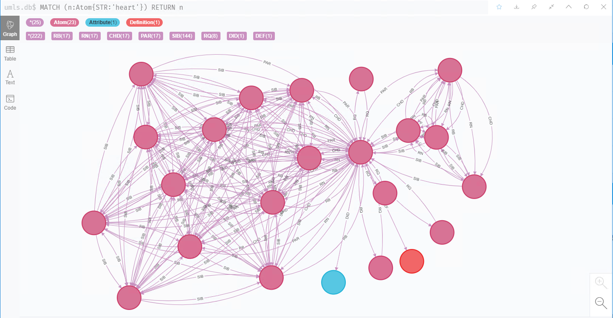

# Multimodal Medical Graph Database (MMGD)
This project hosts relevant codes of the research on constructing a Generative Adversarial Networks(GAN)-based multimodal medical graph dabase, which we are currrently developing. 

## Features
1. Leverage UMLS concepts and relations to construct unimodal medical knowledge graph
2. Leverage various GAN models to depict complicated structures of multimodal medical knowledge in real life. 
3. A simple implementation of the prototype MMGD system. 

## GAN Architectures
1. DCGAN for generating real medical instances
2. StackedGAN for integrating text and image modalities
3. conditioanl GAN for utilizing label information of medical image
4. pix2pix for co-learning between two modalities with different amount of information
5. CycleGAN for obtain high-quality medical image for diagnosis and treatment
6. 3DGAN for generating 3-dimensional medical concept

## Experimental results

## Paper
Forthcoming...

